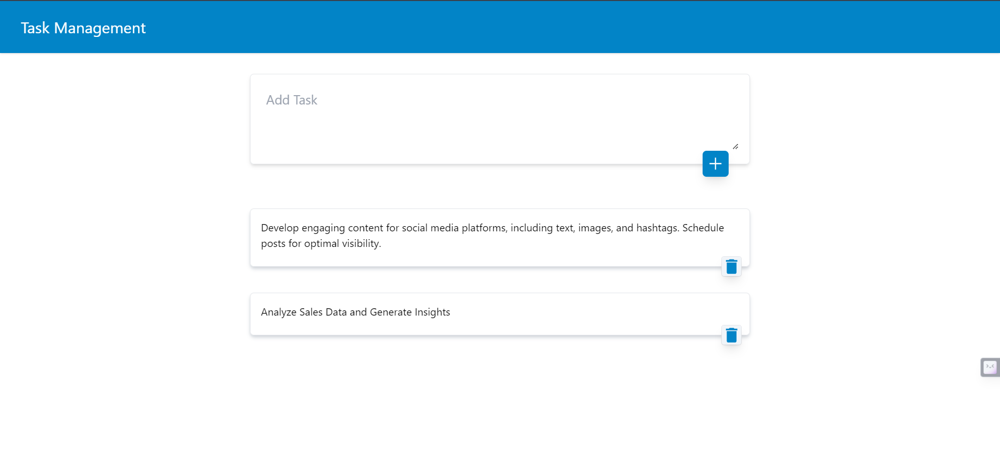
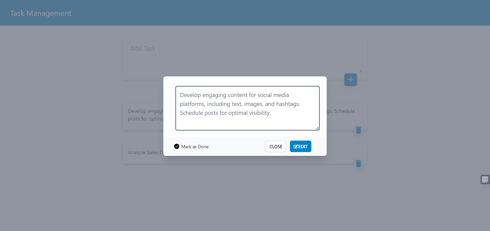
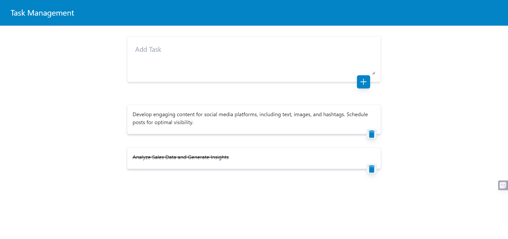
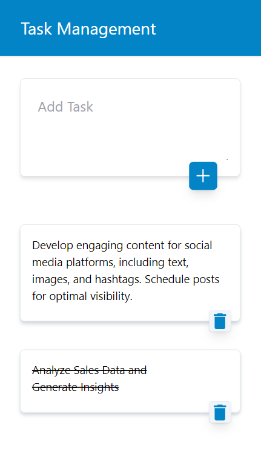

# React Tasks App

A simple React tasks app that allows users to create, display, edit, and delete tasks. The app provides a clean and user-friendly interface, implementing various features to enhance the user experience.

Live URL - https://taskmanagement-react.netlify.app/

## Features

### Task Creation

- Create a new task.

### Task Display

- Display the list of tasks.
- Provide an option to view the full task in a separate view or modal.

### Edit and Delete Functionality

- Allow users to edit or delete their tasks.
- Implement confirmation prompts for deleting tasks to prevent accidental deletion.

### State Management with Redux

- Utilize Redux to manage the state of the tasks, providing a centralized data store for efficient state management.

### Styling with Tailwind CSS

- Implement a clean and visually appealing user interface using Tailwind CSS, ensuring a modern and responsive design.

### Responsive Design

- Ensure the app is responsive and looks good on both desktop and mobile devices, providing a seamless experience across different screen sizes.

### Local Storage Integration

- Save the tasks in the browser's local storage, enabling persistence of tasks even after the browser is closed. This ensures that users can access their tasks across sessions.

## Installation Guide

Follow these steps to set up and run the React Tasks App:

1. **Clone the Repository:**
   ```bash
   git clone https://github.com/poornesh-chenna/ResoTech-assignment.git
   ```
2. **Navigate to the Project Directory:**
   ```
   cd react-tasks-app
   ```
3. **Install Dependencies:**
   ```
   npm install
   ```
4. Run the App
   ```
   npm start
   ```
5. Open your browser and navigate to http://localhost:3000 to access the React Tasks App.


## Screenshots








